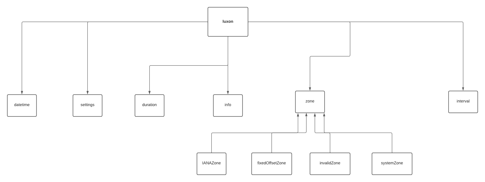

# INFO 443 Project 2 Luxon Software 

### 1 | Introduction 

<strong> 1.1 What is the software system, and what does it do? </strong>

Luxon is a JavaScript library where it allows software developers to work with dates and times when writing JavaScript code.

<strong> 1.2 Who created the software, and who currently "maintains" it? </strong>

Luxon was created by an independent developer, Isaac Cambron (icambron on GitHub), after working on a different date and time-related Javascript library and identifying potential areas of improvement. Luxon is maintained and collaborated on by a community of 170 contributors with it being an open source software.

<strong> 1.3 Where to Find More Information About the System? 
</strong>

<em> GitHub Repo: https://github.com/moment/luxon 
</em>

<em> General Documentation: https://moment.github.io/luxon/#/?id=luxon 
</em>

### 2 | Development View

<em> Figure 1: System Diagram </em>

The Luxon package is composed of several components with different purposes, as indicated below in the table. 

| Component Name      | Purpose     |
|:--------------------|:--------------|
| DateTime          | Data structure representing a specific date and time, contains classes and instance methods for creating and transforming them.      | 
| Duration          | This object represents a period of time. Conceptually, it’s a map of units to their quantities.  | 
| Interval          | This object represents a half-open interval of time, where each endpoint is a DateTime.       |
| Info          | This class contains static methods for retrieving general time and date related data.           | 
| Zone          | This class represents the time zone that the user is working with.          | 
| FixedOffsetZone  | This class represents a zone with a fixed offset (meaning no DST) | 
| IANAZone         | This class represents a zone identified by an IANA identifier, like America/New_York    | 
| InvalidZone      | This class represents a  zone that failed to parse. Users should never need to instantiate this. | 
| SystemZone      | This class represents the local zone for this JavaScript environment. |
| Settings         | Settings contain static getters and setters that control Luxon's overall behavior.          | 
| LuxonError       | This class represents different error messages to throw exceptions.  | 

 In terms of dependencies between the components, The FixedOffsetZone, IANAZone, InvalidZone, and SystemZone all depend on the Zone class since these classes extend from the Zone class. Moreover, since the Interval class used the interface of DateTime and/or Duration  to create an Interval object, which can be made up of a start DateTime and an end DateTime or a start DateTime and a specific Duration, thus, the Interval class is dependent on the DateTime and the Duration class. In terms of dependencies on outside systems and libraries,, class LuxonError is dependent on class Error of Javascript, since it extends from class Error to create custom error classes. The diagram below shows the relationships between the components of Luxon more clearly: 

*The diagram shows the main system components of Luxon Package library*

 In terms of the high-level codeline mode, the source code structure of luxon includes 10  files, with 8 representing main components: DateTime defined in datetime.js, Duration  defined in duration.js,  Interval defined in interval.js, LuxonError defined in errors.js, Info defined in info.js, Interval defined in interval.js, Setting defined in settings.js, Zone defined in zone.js,  whereas FixedOffsetZone, IANAZone, InvalidZone, and SystemZone are all defined in a separate Zones folder. In addition to this, within the source code structure, there’s a separate folder called impl just for formatting and parsing time tokens.  Overall, the luxon.js file contains all 8 main interface component javascript files in order to be deployed in package. json

 In terms of testing and configuration of Luxon, Luxon doesn't have any automated testing integrated into the code. It has a separate testing folder called test that would allow developers to use jest testing to test and view a full coverage report. The developers can run jest on their command line and test all the 5 main interface components globally  including Datetime, duration, info, interval, zone, along with the time formatting folder impl. Each interface  folder has different javascript files to test separate functions of that interface: creating, formatting, transforming, etc. When using this system, users need to include Luxon in a script tag; they can access its various classes through the luxon global. For system building, developers need to run babel node  in order to convert javascript code into compatible versions in current and older browsers or environments.

### 3 | Applied Perspective

<strong>Performance and Scalability Perspective</strong>

For the luxon library, it is important to consider the performance and scalability perspective. It is no surprise that luxon is one of the best JavaScript libraries for time management where hundreds of thousands of users use it on a daily basis. With the high usability and frequency, we should always acknowledge the fact that the workload of the system could get increased periodically due to an increase in the number of requests, transactions, and the work the system is required to process per unit of time. In such case, we would need to be able to predict the performance of the system as accurate as possible in a timely manner. There are a few performance and scalability concerns that are relevant to the system, which include the response time, throughput, and the ability to achieve long-term scabiliby. In terms of the response time concern, we need to figure out the responsiveness of the system in which how quickly it takes to respond to routine workloads, such as user requests on a daily update on dates and times. We also need to take into account the turnaround time of the system in which how quickly it takes to complete larger tasks requested by the users. When it comes to the throughput concern, we need to acknowledge the amount of workload the system is capable of handling in a unit time period. We want to avoid the situation of the throughput is being too high to the point where it takes the same amount of time to respond to tasks. Lastly, we want to understand the ability of the system to manage long-term scalability. It is important for the system to be able to quickly respond to tasks as the workload increases gradually in both the short and long terms. 

<strong>Usability Perspective </strong>

For the luxon library, usability perspective is crucial to take into consideration in which it ensures to deliver an effective user experience and a high level of success for the system. Particularly, we want to understand how effectively the system functions when any users such as support personnel interact with it directly or indirectly. There are a few usability concerns that are relevant to the system, which include the usability of the user interface, process flow, and information quality. We want to make sure that the system guarantees to deliver the same features and functionalities to any types of users at a high quality. Meanwhile, the system should follow a simple, easily understandable, and consistent process flow at all times. This helps to ensure that the tasks being performed in the system correctly and efficiently. Furthermore, we want to look into the system to verify that the data is maintained accurately, relevantly, consistently, and reliable. This allows us to only process and store valid data into the system and increase the successful usage of the system. 

### 4 | Styles & Patterns

<strong>Architectural Style</strong>

Luxon Package doesn’t follow any specific architectural style since it’s a Javascript library that relies on API, meaning that the user will send a specific request to the system and in turn get the result carried out by the library’s various functions, classes and methods. 
  

<strong>Patterns</strong>

One design pattern Luxon uses is the <strong>Singleton Pattern</strong>, the creational design pattern where only one instance of a class can exist at a time. This pattern is implemented twice in the Luxon package, being utilized in SystemZone and FixedOffsetZone subclasses. The javascript files with these subclasses both initialize a variable named “singleton”, that are equal to null. Then, a function inside the subclass checks the value of the “singleton” variable. In SystemZone, this function is returning an instance of SystemZone that is equal to the local time zone. In FixedOffsetZone, this function is returning an instance of FixedOffsetZone that is equal to the UTC (Coordinated Universal Time). Both of these functions incorporate the Singleton pattern by introducing the initialized variable, and then creating an instance using only that variable. So, any time the function is called, if there already exists an instance of the singleton variable, it is then overridden by the new instance. This ensures that only one instance of these classes are existing at any one point. 

 The second design pattern embedded in Luxon is the <strong>Prototype Design Pattern</strong>, a creational design pattern that lets programmers copy existing objects without making the code dependent on their classes. In Luxon, this is evident in the Datetime class when it creates a Clone method for “setters” to use to create a new object while only changing some of the properties. We can see this particularly with a setter class called setZone using Clone to create a new Datetime object (copy along all its old properties: Zone, Locale, Invalid, etc), and then specify that if the time is not in the same time zone, this class could create a new prototype of the old Datetime object in order to report different local times and consider DSTs when making computations. The purpose of this pattern is to reduce the number of subclasses that only differ in the way they initialize their respective objects. This pattern also helps get rid of repeated initialization code in favor of cloning pre-built prototypes. 

 The third design pattern Luxon uses is the <strong>Factory Method</strong> pattern, in which a “template” class with abstract operations delegates its responsibilities to subclasses. In Luxon, this is evident in the Zone class and the subsequent subclasses of Zone: FixedOffsetZone, IANAZone, InvalidZone, and SystemZone (all found in the zones folder inside src). The parent class, Zone, creates an abstract class in which most of the functions return errors. Instead of addressing these behaviors, Zone delegates them to the different subclasses, which override the Zone function behaviors with more specific behavior that actually returns output. By implementing this pattern, Luxon is able to establish which subclass is needed to be instantiated, rather than having to jump through multiple hoops to achieve the same outcome.

### 5 | Architectural Assessment 
<ul>
  <li> Luxon adheres to the <strong> Open-Closed Principle </strong> as it promotes the use of an interface, namely Zone, that enable extensions without changing the existing code. Zone specifies eight methods, which needs to be implemented by all classes that extend it, but it provides flexibility to add optional methods. There are currently four different types of subclasses under Zone - those being FixedOffsetZone, IANAZone, InvalidZone, and SystemZone. While FixedOffsetZone exists to support zones with no Daylight Saving Time, IANAZone exists to support zones according to internet’s globally unique identifiers. Like this, if there’s a need to support additional features to Luxon, the developers can simply create a new class that extends Zone with additional behaviors. This again requires no change to the source code, adhering to the “closed for modification” while being “open for extension”. Higher-level component is protected from the changes made to any lower-level components. </li>
  <li> Luxon also adheres to the <strong> Interface Segregation Principle </strong> as users are not exposed to methods they don’t need when instantiating classes in Luxon. Although it might seem like Luxon is violating the principle at a first glance with most of the classes being bulky, all the operations declared have specific use and deserve to be within those classes. One of the factors which indicate that Luxon adheres to the principle is that there are no methods throwing exceptions. Exceptions are often thrown when a class doesn’t support specific operations. The Datetime, Duration, and Interval classes in Luxon currently have a couple of overlapping methods to each other - those being ‘toJSON()’ and ‘toISO()’’. The methods were described as overlapping, but they actually don’t as they go through distinctly different operations to give outputs. If Luxon were to make those methods as interfaces instead, and have the Datetime, Duration, and Interval classes extend the interfaces, we might see a lot of exceptions thrown in classes. The methods in toJSON interface might be supported by one deriving class, but not the other, creating unwanted side effects. Another factor which indicates that Luxon adheres to the principle is that the users don’t have to pass null (or equivalent value) into methods. We pass in null when the users don’t require dependency of one of the parameters. In a nutshell, Luxon segregated the classes so that all irrelevant methods are independent of each other. </li>
  <li> Luxon adheres to the <strong> Dependency Inversion Principle </strong> as well where the system itself depends on abstractions rather than concrete classes. When it comes to setting different types of zone, the system replies on calling the Zone interface where it includes four different types of Zone modules (which they are FixedOffsetZone, IANAZone, InvalidZone, and SystemZone). In this case, the Zone interface serves as an abstraction where it does not depend on class implementation details, since it does not require any imports from low-level modules. This allows for easier re-use of the Zone functionality in the system for the users. 
</li>
</ul>  

### 6 | System Improvement

<strong>Refactoring code</strong>

The first code refactoring I made is for 2 methods in Interval.js called “before" and “after" using Parameterize method. I recognized that some code of these 2 methods are duplicated due to having the same  internal values but different actions , I intend to introduce a new boolean parameter called "extendForward" that will check whether the users want to create a new interval by adding or subtracting a duration from a datetime object. This helps improve the system in the way that if the Luxon creators want to add another version of this functionality, they could simply run this method with a different parameter instead of creating another method. The changes of this method can be viewed at this system repo: https://github.com/wanyuguan/luxon 

<strong>Feature Improvement</strong>

One feature improvement for Luxon is to make Duration.toHuman() method print more human-readable strings. Currently, there are 2 issues with this toHuman method. Firstly, if a Duration is created with some units being 0 then those units are still printed using the toHuman method, which doesn't benefit humans. Secondly, if a Duration is created with an empty object then an empty string is returned with the toHuman method, which is not human-readable. As a solution, I think toHuman should be either renamed as it only returns the representation of the duration with unit names attached and not really human-friendly output or the above issues can be improved. To fix this issue, an additional parameter can be introduced to specify the smallest unit to print, which is seconds instead of milliseconds. This parameter “seconds” will also serve as a unit to print if the duration contains an empty unit. The changes of this method can be viewed at this system repo: https://github.com/wanyuguan/luxon 

